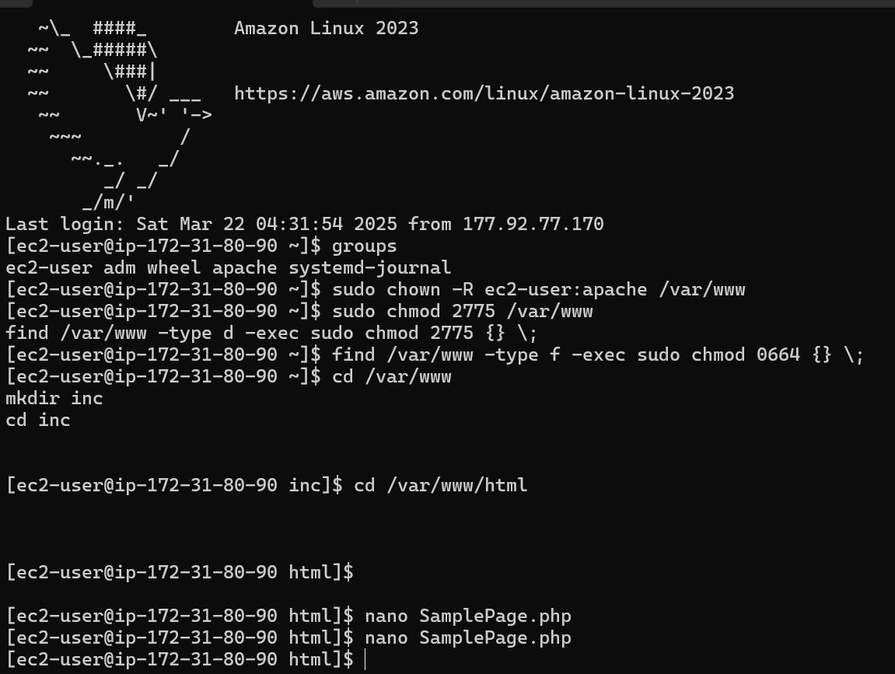

# Sistema de Cadastro de Funcionários

## Descrição
Este é um sistema simples de cadastro de funcionários desenvolvido em PHP e MySQL. O sistema permite adicionar, visualizar e gerenciar informações de funcionários em um banco de dados.

## Funcionalidades
- Cadastro de funcionários com 4 parâmetros diferentes:
  - Nome (texto)
  - Salário (decimal)
  - Data de Nascimento (data)
  - Status Ativo (booleano)
- Visualização de todos os funcionários cadastrados em formato tabular
- Formatação automática de valores (R$, datas no formato brasileiro)
- Criação automática da tabela no banco de dados, se não existir

## Estrutura de Arquivos
- `index.php` - Arquivo principal com toda a lógica de cadastro e visualização
- `../inc/dbinfo.inc` - Arquivo de configuração do banco de dados (não incluído)

## Requisitos
- Servidor web com suporte a PHP (Apache, Nginx, etc.)
- PHP 7.0 ou superior
- MySQL ou MariaDB
- Arquivo de configuração `dbinfo.inc` com as seguintes constantes:
  ```php
  define('DB_SERVER', 'localhost'); // Endereço do servidor MySQL
  define('DB_USERNAME', 'username'); // Nome de usuário do MySQL
  define('DB_PASSWORD', 'password'); // Senha do MySQL
  define('DB_DATABASE', 'database'); // Nome do banco de dados
  ```

## Configuração
1. Crie um diretório `inc` no nível acima do arquivo principal
2. Dentro deste diretório, crie um arquivo `dbinfo.inc` com suas credenciais de banco de dados
3. Certifique-se de que o usuário do banco de dados tem permissões para criar tabelas

## Estrutura do Banco de Dados
A aplicação cria automaticamente uma tabela chamada `EMPLOYEES` com a seguinte estrutura:

| Campo     | Tipo           | Descrição                  |
|-----------|----------------|----------------------------|
| ID        | INT (PK, AUTO) | Identificador único        |
| NAME      | VARCHAR(45)    | Nome do funcionário        |
| SALARY    | DECIMAL(10,2)  | Salário do funcionário     |
| BIRTHDATE | DATE           | Data de nascimento         |
| ACTIVE    | TINYINT(1)     | Status (1=Ativo, 0=Inativo)|

## Como Usar
1. Acesse a página pelo navegador
2. Preencha o formulário com as informações do funcionário
3. Clique em "Adicionar Funcionário"
4. O funcionário será adicionado e aparecerá na tabela abaixo

## Observações
- A aplicação inclui validação básica de dados
- O sistema formata automaticamente valores monetários e datas
- A tabela é ordenada por ID em ordem decrescente (mais recentes primeiro)


-----

## Vídeo
Segue o link para o [vídeo da atividade.](https://youtu.be/0yfCxbaT4HA) 


### Terminal
Como ressaltado no vídeo, não foi possível filmar o terminal utilizado. Dessa forma, segue algumas imagens para cumprir com o requisito.

<div align="center">

</div>
